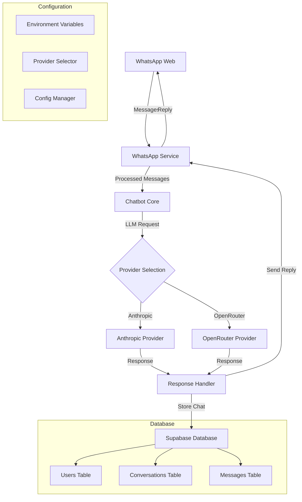
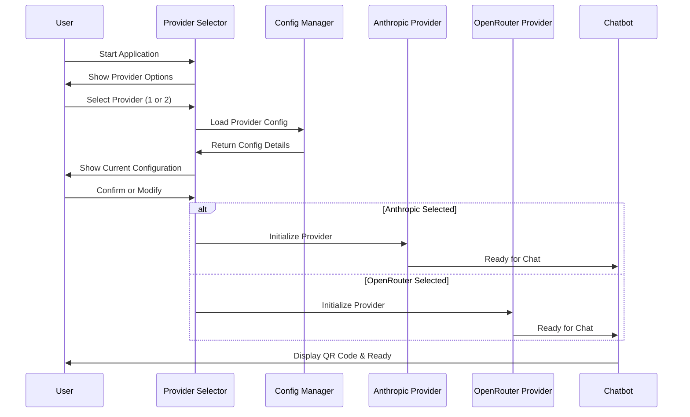
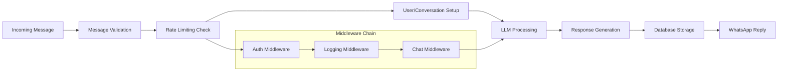
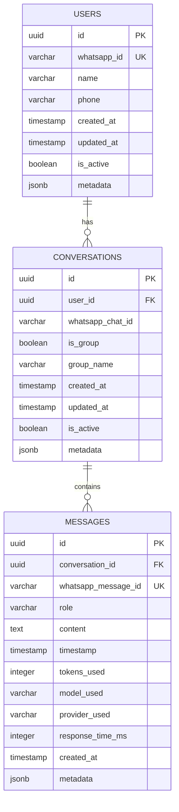

# 🤖 WhatsApp AI Chatbot

> **Efficient WhatsApp chatbot using whatsapp-web.js with multi-provider LLM support (Anthropic & OpenRouter) and Supabase database integration**

[](https://www.typescriptlang.org/)
[](https://nodejs.org/)
[](https://web.whatsapp.com/)
[](https://supabase.com/)

## 📋 Table of Contents

- [🚀 Quick Start](#-quick-start)
- [🏗️ Architecture](#-architecture)
- [📁 File Structure](#-file-structure)
- [⚙️ Configuration](#-configuration)
- [🗃️ Database Schema](#-database-schema)
- [📊 Development Status](#-development-status)
- [🗺️ Roadmap](#-roadmap)
- [📚 API Documentation](#-api-documentation)
- [🛠️ Setup Guide](#-setup-guide)
- [💡 Usage Examples](#-usage-examples)
- [🤝 Contributing](#-contributing)

## 🚀 Quick Start

```bash
# Clone the repository
git clone <repository-url>
cd neshauto

# Install dependencies
npm install

# Copy environment file and configure
cp .env.example .env
# Edit .env with your API keys

# Start the bot
npm run dev
```

The bot will ask you to choose between **Anthropic** or **OpenRouter** providers and display a QR code to scan with WhatsApp.

## 🏗️ Architecture

### System Overview



### Provider Selection Flow



### Message Processing Pipeline



### Database Schema



## 📁 File Structure

```
neshauto/
├── 📄 PROJECT.md                   # This documentation
├── 📄 README.md                    # Basic setup instructions
├── 📄 package.json                 # Node.js dependencies
├── 📄 tsconfig.json               # TypeScript configuration
├── 📄 .env.example                # Environment template
├── 📄 .env                        # Your environment variables
├── 📄 .gitignore                  # Git ignore rules
│
├── 📁 src/                        # Source code
│   ├── 📄 index.ts                # Application entry point
│   │
│   ├── 📁 bot/                    # Chatbot logic
│   │   └── 📄 chatbot.ts          # Main chatbot class
│   │
│   ├── 📁 providers/              # LLM provider implementations
│   │   ├── 📄 index.ts            # Provider exports
│   │   ├── 📄 base.ts             # Base provider class
│   │   ├── 📄 anthropic.ts       # Anthropic (Claude) provider
│   │   └── 📄 openrouter.ts      # OpenRouter provider
│   │
│   ├── 📁 services/               # External service integrations
│   │   ├── 📄 index.ts            # Service exports
│   │   ├── 📄 whatsapp.ts         # WhatsApp Web integration
│   │   └── 📄 database.ts         # Supabase database service
│   │
│   ├── 📁 types/                  # TypeScript type definitions
│   │   ├── 📄 index.ts            # Type exports
│   │   ├── 📄 llm.ts              # LLM-related types
│   │   └── 📄 whatsapp.ts         # WhatsApp-related types
│   │
│   └── 📁 utils/                  # Utility functions
│       ├── 📄 config.ts           # Configuration management
│       └── 📄 provider-selector.ts # Interactive provider selection
│
└── 📁 dist/                       # Compiled JavaScript (generated)
    └── ... (build output)
```

## ⚙️ Configuration

### Environment Variables

| Variable | Description | Default | Required |
|----------|-------------|---------|----------|
| **LLM Configuration** |
| `ANTHROPIC_API_KEY` | Anthropic API key for Claude | - | ✅ (if using Anthropic) |
| `OPENROUTER_API_KEY` | OpenRouter API key | - | ✅ (if using OpenRouter) |
| **Anthropic Settings** |
| `ANTHROPIC_MODEL` | Claude model to use | `claude-3-5-sonnet-20241022` | ❌ |
| `ANTHROPIC_MAX_TOKENS` | Max tokens for Anthropic | `1000` | ❌ |
| `ANTHROPIC_TEMPERATURE` | Temperature for Anthropic | `0.7` | ❌ |
| **OpenRouter Settings** |
| `OPENROUTER_MODEL` | Model to use via OpenRouter | `anthropic/claude-3.5-sonnet` | ❌ |
| `OPENROUTER_MAX_TOKENS` | Max tokens for OpenRouter | `1500` | ❌ |
| `OPENROUTER_TEMPERATURE` | Temperature for OpenRouter | `0.8` | ❌ |
| **WhatsApp Configuration** |
| `WHATSAPP_SESSION` | Session name for WhatsApp | `default` | ❌ |
| `WHATSAPP_QR_MAX_RETRIES` | Max QR code retries | `3` | ❌ |
| `WHATSAPP_RESTART_ON_AUTH_FAIL` | Restart on auth failure | `true` | ❌ |
| **Bot Behavior** |
| `BOT_SYSTEM_PROMPT` | System prompt for the bot | See default | ❌ |
| `BOT_ENABLE_LOGGING` | Enable conversation logging | `true` | ❌ |
| `BOT_RATE_LIMIT_MAX_REQUESTS` | Max requests per window | `10` | ❌ |
| `BOT_RATE_LIMIT_WINDOW_MS` | Rate limit window (ms) | `60000` | ❌ |
| **Supabase Database** |
| `SUPABASE_URL` | Supabase project URL | - | ✅ |
| `SUPABASE_ANON_KEY` | Supabase anonymous key | - | ✅ |
| `SUPABASE_PROJECT_ID` | Supabase project ID | - | ❌ |
| **Server Settings** |
| `PORT` | Server port | `3000` | ❌ |
| `ENABLE_HEALTH_CHECK` | Enable health endpoints | `true` | ❌ |

### Provider-Specific Models

#### Anthropic (Claude)
- `claude-3-5-sonnet-20241022` (default)
- `claude-3-5-haiku-20241022`
- `claude-3-opus-20240229`

#### OpenRouter
- `anthropic/claude-3.5-sonnet` (default)
- `openai/gpt-4-turbo-preview`
- `google/gemini-pro`
- `meta-llama/llama-2-70b-chat`
- And many more...

## 🗃️ Database Schema

### Current Schema (Supabase)

**Database URL:** `https://ithiapyugznouiwxeweq.supabase.co`  
**Region:** Singapore (ap-southeast-1)

#### Tables

##### 👥 Users
Stores WhatsApp user information
```sql
CREATE TABLE users (
  id UUID PRIMARY KEY DEFAULT gen_random_uuid(),
  whatsapp_id VARCHAR(255) UNIQUE NOT NULL,
  name VARCHAR(255),
  phone VARCHAR(50),
  created_at TIMESTAMP WITH TIME ZONE DEFAULT NOW(),
  updated_at TIMESTAMP WITH TIME ZONE DEFAULT NOW(),
  is_active BOOLEAN DEFAULT true,
  metadata JSONB DEFAULT '{}'
);
```

##### 💬 Conversations
Manages chat sessions
```sql
CREATE TABLE conversations (
  id UUID PRIMARY KEY DEFAULT gen_random_uuid(),
  user_id UUID REFERENCES users(id) ON DELETE CASCADE,
  whatsapp_chat_id VARCHAR(255) NOT NULL,
  is_group BOOLEAN DEFAULT false,
  group_name VARCHAR(255),
  created_at TIMESTAMP WITH TIME ZONE DEFAULT NOW(),
  updated_at TIMESTAMP WITH TIME ZONE DEFAULT NOW(),
  is_active BOOLEAN DEFAULT true,
  metadata JSONB DEFAULT '{}'
);
```

##### 📝 Messages
Stores all chat messages and responses
```sql
CREATE TABLE messages (
  id UUID PRIMARY KEY DEFAULT gen_random_uuid(),
  conversation_id UUID REFERENCES conversations(id) ON DELETE CASCADE,
  whatsapp_message_id VARCHAR(255) UNIQUE NOT NULL,
  role VARCHAR(20) CHECK (role IN ('user', 'assistant', 'system')),
  content TEXT NOT NULL,
  timestamp TIMESTAMP WITH TIME ZONE NOT NULL,
  tokens_used INTEGER,
  model_used VARCHAR(100),
  provider_used VARCHAR(50),
  response_time_ms INTEGER,
  created_at TIMESTAMP WITH TIME ZONE DEFAULT NOW(),
  metadata JSONB DEFAULT '{}'
);
```

#### Indexes for Performance
- `idx_users_whatsapp_id` on users(whatsapp_id)
- `idx_conversations_user_id` on conversations(user_id)
- `idx_messages_conversation_id` on messages(conversation_id)
- `idx_messages_timestamp` on messages(timestamp)

## 📊 Development Status

### ✅ Completed Features (Phase 1)

| Feature | Status | Description |
|---------|--------|-------------|
| 🚀 Project Setup | ✅ | TypeScript, Node.js, package configuration |
| 📦 Dependencies | ✅ | whatsapp-web.js, Anthropic SDK, Supabase client |
| 🏗️ Architecture | ✅ | Modular provider-based architecture |
| 🤖 Anthropic Integration | ✅ | Claude API with full configuration |
| 📱 WhatsApp Service | ✅ | QR code, message handling, middleware system |
| 🧠 Chatbot Core | ✅ | Message processing, conversation management |
| ⚙️ Configuration | ✅ | Environment-based config with validation |
| 🔄 OpenRouter Provider | ✅ | Multi-model support via OpenRouter |
| 🎛️ Interactive Setup | ✅ | Provider selection at startup |
| 🗄️ Supabase Database | ✅ | Singapore region, complete schema |
| 💾 Database Integration | ✅ | Full CRUD operations, chat history |

### 🔄 In Progress (Phase 2)

| Feature | Status | Priority | Description |
|---------|--------|----------|-------------|
| 🛡️ Error Handling | 🔄 | High | Comprehensive error management |
| 📈 Performance Optimization | 🔄 | High | Caching, connection pooling |
| 📖 Documentation | 🔄 | Medium | Complete API and setup docs |

### 📋 Planned Features (Phase 3)

| Feature | Priority | Description |
|---------|----------|-------------|
| 🎯 Commands System | High | `/help`, `/stats`, `/clear` commands |
| 🔗 Webhooks | High | External integrations and notifications |
| 🧪 Testing Framework | High | Unit and integration tests |
| 📊 Analytics Dashboard | Medium | Usage stats and monitoring |
| 🚀 Deployment Configs | Medium | Docker, PM2, cloud deployment |
| 🔒 Authentication | Medium | User-based access control |
| 🌐 Multi-language | Low | Internationalization support |
| 🎨 Rich Media | Low | Image, document, voice message support |

## 🗺️ Roadmap

### Phase 1: Core Functionality ✅ **COMPLETED**
- [x] Basic WhatsApp integration
- [x] Multi-provider LLM support (Anthropic, OpenRouter)
- [x] Database integration with Supabase
- [x] Interactive provider selection
- [x] Configuration management
- [x] Message processing pipeline

### Phase 2: Enhancement & Optimization 🔄 **IN PROGRESS**
- [ ] Advanced error handling and recovery
- [ ] Performance optimizations (caching, pooling)
- [ ] Comprehensive logging and monitoring
- [ ] Rate limiting and abuse prevention
- [ ] Memory management and cleanup
- [ ] Health checks and metrics

### Phase 3: Advanced Features 📋 **PLANNED**
- [ ] Command system (`/help`, `/stats`, `/settings`)
- [ ] Webhook integrations
- [ ] Admin panel for management
- [ ] User authentication and permissions
- [ ] Analytics and usage tracking
- [ ] Multi-session support

### Phase 4: Production & Scale 🚀 **FUTURE**
- [ ] Docker containerization
- [ ] Kubernetes deployment configs
- [ ] CI/CD pipeline setup
- [ ] Load balancing and clustering
- [ ] Backup and disaster recovery
- [ ] Security hardening

## 📚 API Documentation

### LLM Provider Interface

```typescript
interface LLMProvider {
  name: string;
  generateResponse(
    messages: LLMMessage[], 
    options?: LLMGenerationOptions
  ): Promise<LLMResponse>;
}
```

### Message Types

```typescript
interface BotMessage {
  id: string;
  content: string;
  from: string;
  timestamp: number;
  isGroup: boolean;
  groupName?: string;
  senderName?: string;
}

interface BotResponse {
  content: string;
  mentions?: string[];
  quotedMessage?: string;
}
```

### Database Service Methods

```typescript
class DatabaseService {
  // User management
  getOrCreateUser(whatsappId: string, name?: string): Promise<User>
  
  // Conversation management
  getOrCreateConversation(userId: string, chatId: string): Promise<Conversation>
  
  // Message storage
  saveUserMessage(botMessage: BotMessage): Promise<{user, conversation, message}>
  saveBotResponse(conversationId: string, ...): Promise<Message>
  
  // History retrieval
  getConversationHistory(conversationId: string, limit?: number): Promise<Message[]>
  
  // Analytics
  getUserStats(userId: string): Promise<UserStats>
  getSystemStats(): Promise<SystemStats>
}
```

## 🛠️ Setup Guide

### Prerequisites

- **Node.js** >= 18.0.0
- **npm** or **yarn**
- **Anthropic API Key** (get from [console.anthropic.com](https://console.anthropic.com))
- **OpenRouter API Key** (optional, get from [openrouter.ai](https://openrouter.ai))
- **Supabase Account** (for database)

### Installation Steps

1. **Clone the Repository**
   ```bash
   git clone <repository-url>
   cd neshauto
   ```

2. **Install Dependencies**
   ```bash
   npm install
   ```

3. **Configure Environment**
   ```bash
   cp .env.example .env
   # Edit .env with your API keys and settings
   ```

4. **Set Up Database**
   - Database is already created in Singapore: `ithiapyugznouiwxeweq.supabase.co`
   - Schema is automatically applied
   - Update `.env` with provided Supabase credentials

5. **Start Development Server**
   ```bash
   npm run dev
   ```

6. **Provider Selection**
   - Choose between Anthropic (1) or OpenRouter (2)
   - Confirm or modify model settings
   - Scan QR code with WhatsApp

### Production Deployment

```bash
# Build the application
npm run build

# Start in production mode
npm start
```

### Development Commands

```bash
npm run dev          # Development with auto-reload
npm run build        # Build TypeScript to JavaScript
npm run start        # Run built application
npm run typecheck    # Type checking only
npm run lint         # ESLint code checking
npm run format       # Prettier code formatting
npm run clean        # Clean build directory
```

## 💡 Usage Examples

### Starting the Bot

```bash
npm run dev
```

**Interactive Setup:**
```
🤖 WhatsApp Chatbot Setup
==========================
Available LLM Providers:
1. Anthropic (Claude)
2. OpenRouter (Multiple Models)

Select your preferred LLM provider (1 or 2): 1

🔧 Setting up Anthropic (Claude) Provider...
✅ Anthropic API key found in environment
📋 Current Anthropic Configuration:
   Model: claude-3-5-sonnet-20241022
   Max Tokens: 1000
   Temperature: 0.7
Use current configuration? (y/n, default: y): y
🚀 Using Anthropic with configured settings
```

### WhatsApp Integration

1. **QR Code Scanning:**
   - Bot displays QR code in console
   - Scan with WhatsApp mobile app
   - Bot connects to WhatsApp Web

2. **Message Processing:**
   - Send any message to the bot
   - Bot processes via selected LLM provider
   - Response sent back to WhatsApp
   - Conversation stored in Supabase

### Configuration Examples

**Anthropic Configuration:**
```env
ANTHROPIC_API_KEY=sk-ant-api03-your-key-here
ANTHROPIC_MODEL=claude-3-5-sonnet-20241022
ANTHROPIC_MAX_TOKENS=1000
ANTHROPIC_TEMPERATURE=0.7
```

**OpenRouter Configuration:**
```env
OPENROUTER_API_KEY=sk-or-your-key-here
OPENROUTER_MODEL=anthropic/claude-3.5-sonnet
OPENROUTER_MAX_TOKENS=1500
OPENROUTER_TEMPERATURE=0.8
```

## 🤝 Contributing

### Development Workflow

1. **Fork the Repository**
2. **Create Feature Branch**
   ```bash
   git checkout -b feature/your-feature-name
   ```
3. **Make Changes**
   - Follow TypeScript best practices
   - Add appropriate error handling
   - Update documentation as needed
4. **Test Your Changes**
   ```bash
   npm run typecheck
   npm run lint
   npm run build
   ```
5. **Commit and Push**
   ```bash
   git commit -m "feat: add your feature description"
   git push origin feature/your-feature-name
   ```
6. **Create Pull Request**

### Code Standards

- **TypeScript**: Strict mode enabled
- **ESLint**: Standard configuration
- **Prettier**: Consistent code formatting
- **Conventional Commits**: Use semantic commit messages

### Project Structure Guidelines

- `src/bot/` - Core chatbot functionality
- `src/providers/` - LLM provider implementations
- `src/services/` - External service integrations
- `src/types/` - TypeScript type definitions
- `src/utils/` - Utility functions and helpers

### Adding New LLM Providers

1. Extend `BaseLLMProvider` class
2. Implement required methods
3. Add provider configuration
4. Update provider selector
5. Add documentation

Example:
```typescript
export class NewProvider extends BaseLLMProvider {
  readonly name = 'new-provider';
  
  async generateResponse(messages: LLMMessage[], options?: LLMGenerationOptions): Promise<LLMResponse> {
    // Implementation
  }
}
```

---

## 📄 License

MIT License - see LICENSE file for details.

## 🙏 Credits

- [whatsapp-web.js](https://github.com/pedroslopez/whatsapp-web.js) - WhatsApp Web integration
- [Anthropic](https://anthropic.com) - Claude AI API
- [OpenRouter](https://openrouter.ai) - Multi-model API access
- [Supabase](https://supabase.com) - Database and backend services

---

**Project Status:** ✅ **Production Ready (Core Features)**  
**Last Updated:** July 16, 2025  
**Version:** 1.0.0