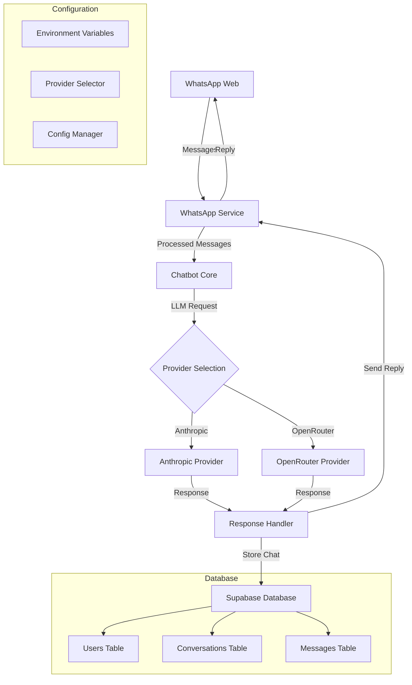
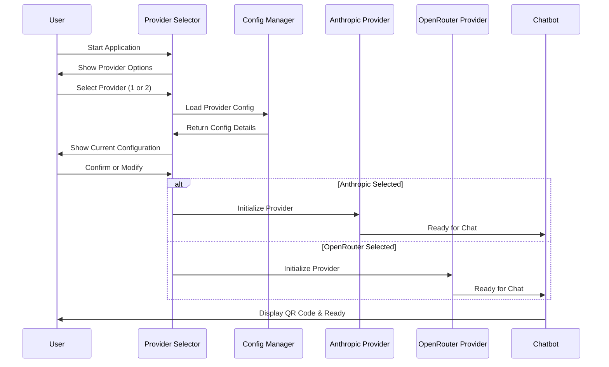
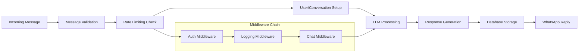
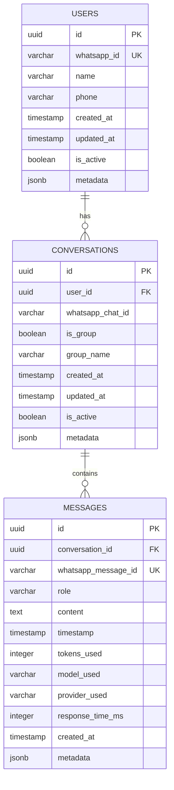

# 🤖 Advanced WhatsApp LLM Automation

> **Powerful WhatsApp chatbot with multi-provider LLM support (Anthropic Claude & OpenRouter) featuring visual QR code display and professional TypeScript architecture**

[](https://www.typescriptlang.org/)
[](https://nodejs.org/)
[](https://web.whatsapp.com/)
[](https://supabase.com/)

## ✨ Key Features

- 🔄 **Multi-Provider LLM Support** - Seamlessly switch between Anthropic Claude and OpenRouter
- 📱 **WhatsApp Web Integration** - Full-featured WhatsApp bot with visual QR code display
- 🏗️ **Modular Architecture** - Clean, maintainable TypeScript codebase
- 🗄️ **Supabase Database** - Persistent conversation history and user management
- ⚙️ **Interactive Setup** - Choose your LLM provider at startup
- 🛡️ **Professional Logging** - Comprehensive error handling and monitoring

## 🚀 Quick Start

```bash
# Clone the repository
git clone https://github.com/CuriosityOS/advanced-whatsapp-llm.git
cd advanced-whatsapp-llm

# Install dependencies
npm install

# Copy environment file and configure
cp .env.example .env
# Edit .env with your API keys

# Start the bot
npm start
```

The bot will display an interactive setup to choose your LLM provider and show a **visual QR code** to scan with WhatsApp.

## 🏗️ Architecture

### System Overview



### Provider Selection Flow



### Message Processing Pipeline



### Database Schema



## 📁 Project Structure

```
advanced-whatsapp-llm/
├── 📄 README.md                    # This documentation
├── 📄 package.json                 # Node.js dependencies
├── 📄 tsconfig.json               # TypeScript configuration
├── 📄 .env.example                # Environment template
├── 📄 .gitignore                  # Git ignore rules
│
├── 📁 src/                        # Source code
│   ├── 📄 index.ts                # Application entry point
│   │
│   ├── 📁 bot/                    # Chatbot logic
│   │   └── 📄 chatbot.ts          # Main chatbot class
│   │
│   ├── 📁 providers/              # LLM provider implementations
│   │   ├── 📄 index.ts            # Provider exports
│   │   ├── 📄 base.ts             # Base provider class
│   │   ├── 📄 anthropic.ts       # Anthropic (Claude) provider
│   │   └── 📄 openrouter.ts      # OpenRouter provider
│   │
│   ├── 📁 services/               # External service integrations
│   │   ├── 📄 index.ts            # Service exports
│   │   ├── 📄 whatsapp.ts         # WhatsApp Web integration
│   │   ├── 📄 database.ts         # Supabase database service
│   │   ├── 📄 embeddings.ts       # Vector embeddings
│   │   ├── 📄 pdf.ts              # PDF processing
│   │   ├── 📄 rag.ts              # RAG implementation
│   │   ├── 📄 vector.ts           # Vector operations
│   │   └── 📄 vision.ts           # Image analysis
│   │
│   ├── 📁 types/                  # TypeScript type definitions
│   │   ├── 📄 index.ts            # Type exports
│   │   ├── 📄 llm.ts              # LLM-related types
│   │   └── 📄 whatsapp.ts         # WhatsApp-related types
│   │
│   └── 📁 utils/                  # Utility functions
│       ├── 📄 config.ts           # Configuration management
│       └── 📄 provider-selector.ts # Interactive provider selection
│
└── 📁 dist/                       # Compiled JavaScript (generated)
    └── ... (build output)
```

## ⚙️ Configuration

### Environment Variables

| Variable | Description | Default | Required |
|----------|-------------|---------|----------|
| **LLM Configuration** |
| `ANTHROPIC_API_KEY` | Anthropic API key for Claude | - | ✅ (if using Anthropic) |
| `OPENROUTER_API_KEY` | OpenRouter API key | - | ✅ (if using OpenRouter) |
| **Anthropic Settings** |
| `ANTHROPIC_MODEL` | Claude model to use | `claude-sonnet-4-20250514` | ❌ |
| `ANTHROPIC_MAX_TOKENS` | Max tokens for Anthropic | `1000` | ❌ |
| `ANTHROPIC_TEMPERATURE` | Temperature for Anthropic | `0.7` | ❌ |
| **OpenRouter Settings** |
| `OPENROUTER_MODEL` | Model to use via OpenRouter | `anthropic/claude-3.5-sonnet` | ❌ |
| `OPENROUTER_MAX_TOKENS` | Max tokens for OpenRouter | `1500` | ❌ |
| `OPENROUTER_TEMPERATURE` | Temperature for OpenRouter | `0.8` | ❌ |
| **WhatsApp Configuration** |
| `WHATSAPP_SESSION` | Session name for WhatsApp | `default` | ❌ |
| `WHATSAPP_QR_MAX_RETRIES` | Max QR code retries | `3` | ❌ |
| `WHATSAPP_RESTART_ON_AUTH_FAIL` | Restart on auth failure | `true` | ❌ |
| **Bot Behavior** |
| `BOT_SYSTEM_PROMPT` | System prompt for the bot | See default | ❌ |
| `BOT_ENABLE_LOGGING` | Enable conversation logging | `true` | ❌ |
| `BOT_RATE_LIMIT_MAX_REQUESTS` | Max requests per window | `10` | ❌ |
| `BOT_RATE_LIMIT_WINDOW_MS` | Rate limit window (ms) | `60000` | ❌ |
| **Supabase Database** |
| `SUPABASE_URL` | Supabase project URL | - | ✅ |
| `SUPABASE_ANON_KEY` | Supabase anonymous key | - | ✅ |

### Supported Models

#### Anthropic (Claude)
- `claude-sonnet-4-20250514` (default)
- `claude-3-5-sonnet-20241022`
- `claude-3-5-haiku-20241022`
- `claude-3-opus-20240229`

#### OpenRouter
- `anthropic/claude-3.5-sonnet` (default)
- `openai/gpt-4-turbo-preview`
- `google/gemini-pro`
- `meta-llama/llama-2-70b-chat`
- And many more...

## 🛠️ Setup Guide

### Prerequisites

- **Node.js** >= 18.0.0
- **npm** or **yarn**
- **Anthropic API Key** (get from [console.anthropic.com](https://console.anthropic.com))
- **OpenRouter API Key** (optional, get from [openrouter.ai](https://openrouter.ai))
- **Supabase Account** (for database)

### Installation Steps

1. **Clone the Repository**
   ```bash
   git clone https://github.com/CuriosityOS/advanced-whatsapp-llm.git
   cd advanced-whatsapp-llm
   ```

2. **Install Dependencies**
   ```bash
   npm install
   ```

3. **Configure Environment**
   ```bash
   cp .env.example .env
   # Edit .env with your API keys and settings
   ```

4. **Set Up Database**
   - Create a Supabase project at [supabase.com](https://supabase.com)
   - Copy your project URL and anon key to `.env`
   - Database schema will be automatically created

5. **Start the Bot**
   ```bash
   npm start
   ```

6. **Provider Selection**
   - Choose between Anthropic (1) or OpenRouter (2)
   - Confirm or modify model settings
   - Scan the visual QR code with WhatsApp

## 💡 Usage Examples

### Starting the Bot

```bash
npm start
```

**Interactive Setup:**
```
🤖 WhatsApp Chatbot Setup
==========================
Available LLM Providers:
1. Anthropic (Claude)
2. OpenRouter (Multiple Models)

Select your preferred LLM provider (1 or 2): 1

🔧 Setting up Anthropic (Claude) Provider...
✅ Anthropic API key found in environment
📋 Current Anthropic Configuration:
   Model: claude-sonnet-4-20250514
   Max Tokens: 1000
   Temperature: 0.7
Use current configuration? (y/n, default: y): y
🚀 Using Anthropic with configured settings
```

### WhatsApp Integration

1. **QR Code Scanning:**
   - Bot displays a **visual QR code** in terminal (not raw text!)
   - Scan with WhatsApp mobile app
   - Bot connects to WhatsApp Web

2. **Message Processing:**
   - Send any message to the bot
   - Bot processes via selected LLM provider
   - Response sent back to WhatsApp
   - Conversation stored in database

### Development Commands

```bash
npm run dev          # Development with auto-reload
npm run build        # Build TypeScript to JavaScript
npm start            # Run built application
npm run lint         # ESLint code checking
```

## 🔧 Key Improvements

### Fixed QR Code Display
- ✅ **Visual QR Code**: Shows scannable QR code pattern instead of raw text
- ✅ **Terminal Integration**: Uses `qrcode-terminal` for proper display
- ✅ **User-Friendly**: Clear instructions for scanning

### Professional Architecture
- ✅ **TypeScript**: Full type safety and modern development
- ✅ **Modular Design**: Clean separation of concerns
- ✅ **Error Handling**: Comprehensive error management
- ✅ **Configuration**: Environment-based configuration

### Database Integration
- ✅ **Persistent Storage**: All conversations saved to Supabase
- ✅ **User Management**: Automatic user registration and tracking
- ✅ **Message History**: Complete conversation history
- ✅ **Analytics Ready**: Usage tracking and metrics

## 🤝 Contributing

1. **Fork the Repository**
2. **Create Feature Branch**
   ```bash
   git checkout -b feature/your-feature-name
   ```
3. **Make Changes** following TypeScript best practices
4. **Test Your Changes**
   ```bash
   npm run build && npm run lint
   ```
5. **Commit and Push**
   ```bash
   git commit -m "feat: add your feature description"
   git push origin feature/your-feature-name
   ```
6. **Create Pull Request**

## 📄 License

MIT License - see LICENSE file for details.

## 🙏 Credits

- [whatsapp-web.js](https://github.com/pedroslopez/whatsapp-web.js) - WhatsApp Web integration
- [Anthropic](https://anthropic.com) - Claude AI API
- [OpenRouter](https://openrouter.ai) - Multi-model API access
- [Supabase](https://supabase.com) - Database and backend services

---

**Status:** ✅ **Ready for Production**  
**Last Updated:** July 16, 2025  
**Version:** 1.0.0